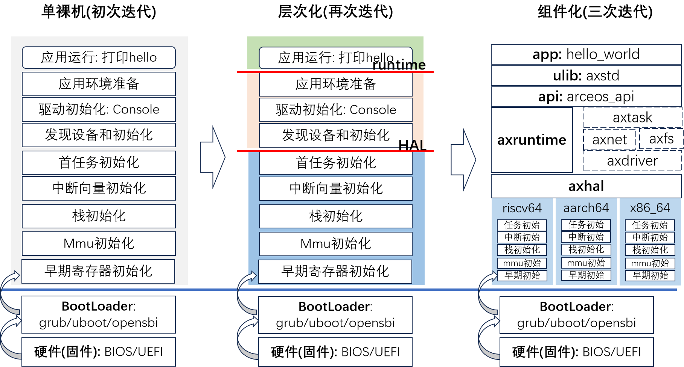
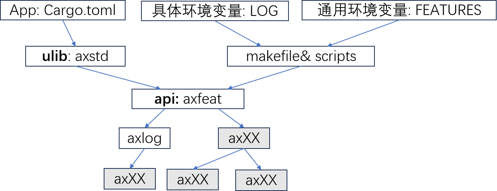

## 设计与实现

### 迭代步骤



### 示例流程（riscv64）


#### 引导过程示例: axhal(riscv64)


#### 引导过程示例: axruntime


#### app引导完成转入运行

应用启动，并基于运行环境提供的各种功能，完成自身的逻辑计算。对于 Helloworld，仅仅需要借助 ulib 中 axstd::println 完成打印输出。


#### 日志级别控制与 features

在编译并运行 helloworld 时，可以指定 LOG 环境变量，以输出不同级别的日志。

```
make LOG=info run
```

这是通过 features 传递，改变 kernel 行为的具体方法。可以通过三种方式指定 features：



###  附录 相关组件

- #### ```axhal``` ：

  - 模块源码位置：[modules/axhal]( https://github.com/rcore-os/arceos/tree/main/modules/axhal)
  - 模块描述： ArceOS 的硬件抽象层，负责为不同操作平台提供统一的 API。它为指定的操作平台进行引导和初始化过程，并在硬件上提供有用的操作。当前主要支持 pc-x86`、`qemu-virt-riscv`、`qemu-virt-aarch64` 等平台。

- #### ```axruntime```：

  - 模块源码位置：[modules/axruntime]((https://github.com/rcore-os/arceos/tree/main/modules/axruntime) )


  - 模块描述：在进入应用程序的 main 函数之前执行一些初始化操作， 根据所选择的 feature 执行相对应的初始化过程。

- #### ```allocator``` ：

  - 模块源码位置：[crates/allocator](https://github.com/rcore-os/arceos/tree/main/crates/allocator)
  - 模块描述： `allocator` 模块提供了一个统一的接口，用于实现不同类型的内存分配器算法。该模块共包括三种不同类型的分配器：字节粒度内存分配器 (`ByteAllocator`)、页粒度内存分配器 (`PageAllocator`) 和唯一 ID 分配器 (`IdAllocator`)。每种分配器都有其特定的实现方式，例如 `BuddyByteAllocator` 和 `SlabByteAllocator` 对应的是字节粒度内存分配器，而 `BitmapPageAllocator` 对应的是页粒度内存分配器。这个模块使得不同的内存分配器可以更加灵活地组合和替换，实现更加高效和可靠的内存管理功能。
