## 设计与实现

### 物理内存布局

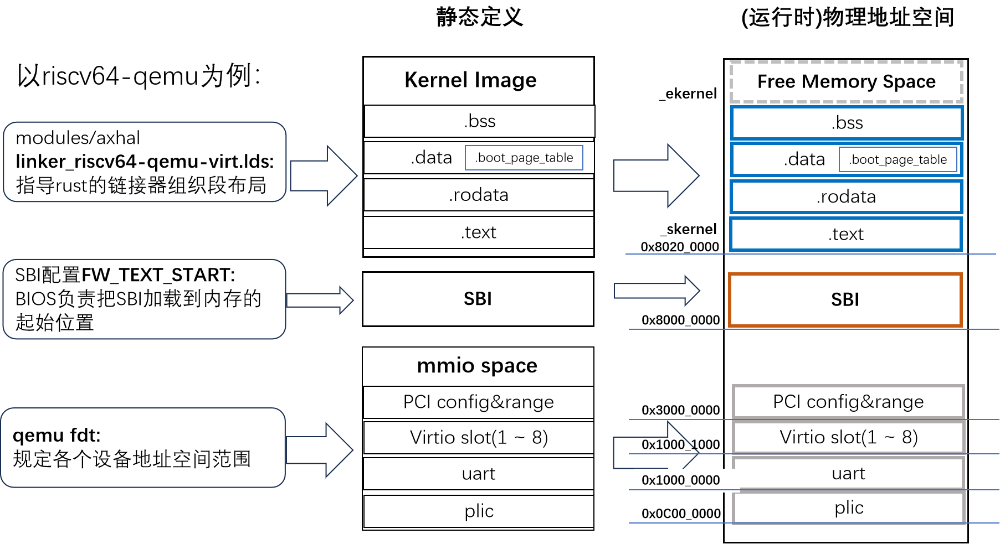

### 分页 – 功能抽象和对应组件

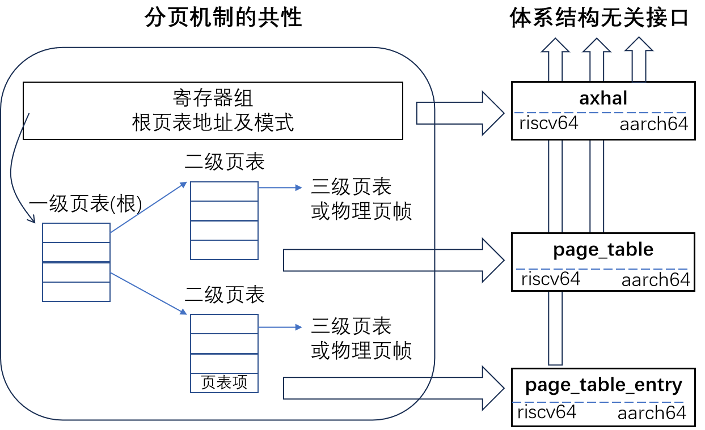


分页启用分两个阶段：早期启用(必须)和后期重建映射(可选) 。

#### 分页阶段1 – 早期启用(必须)

##### 机制

内核启动的早期，采用规定的恒等映射方式。但是只映射一部分物理空间。

目标：完成Paging切换后，建立从虚拟空间0xffff_ffc0_8000_0000 ~ 0xffff_ffc0_8000_0000到物理空间0x8000_0000~0xC000_0000 的映射，范围1G。

**两步完成Paging切换：**

1. 恒等映射保证虚拟空间与物理空间有一个相等范围的地址空间映射(0x80000000~0xC0000000)。切换前后地址范围不变，但地址空间已经从物理空间切换到虚拟空间；
2. 给指令指针寄存器pc，栈寄存器sp等加偏移，在图中该偏移是0xffff_ffc0_0000_0000。如此在虚拟空间执行平移后，就完成到最终目标地址的映射。


#####  代码示例

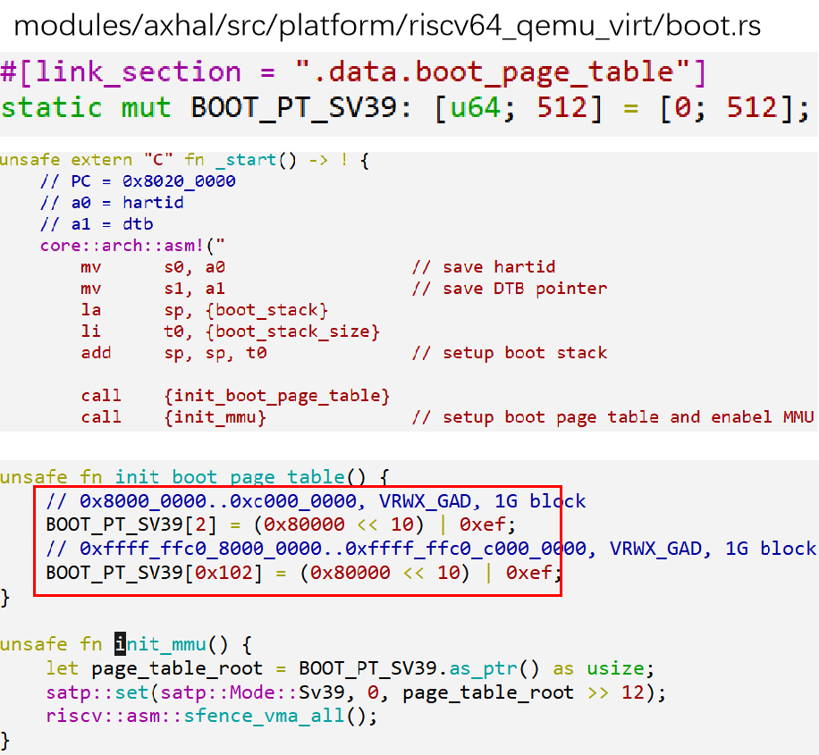

BOOT_PT_SV39使用的是LDS定义布局时，直接预留的一页，所以不用额外内存分配。

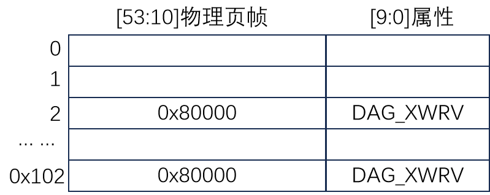

初始化根页表BOOT_PT_SV39，只有一级，即每个页表项直接映射到1G的地址空间。1G = 230 因此pgd_idx = (VA>>30)&(512-1)0x8000_0000 >> 30，对应pgd_idx = 20xffff_ffc0_8000_0000 >> 30，只保留低9位，对应pgd_idx = 0x102物理页帧号 = 物理地址 >> 12，故0x80000。

#### 分页阶段2 – 重建映射(可选)

##### 机制

重建映射的意义：

1. 管理更大范围的地址空间
2. 分类和权限的粒度控制更加细致

BOOT_PT_SV39使用的是LDS定义布局时，直接预留的一页，所以不用额外内存分配。


##### 代码示例

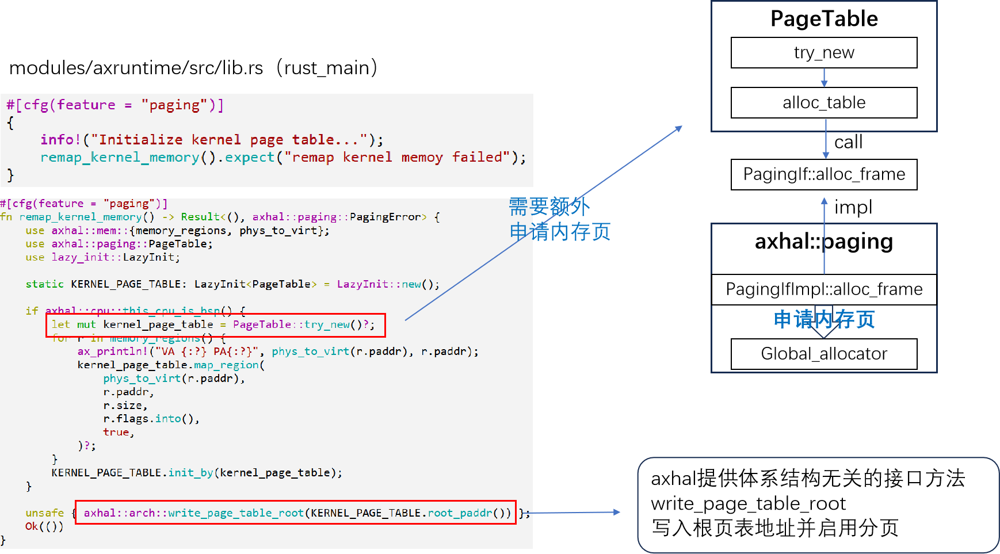

### 内存分配 

#### 接口、框架与算法

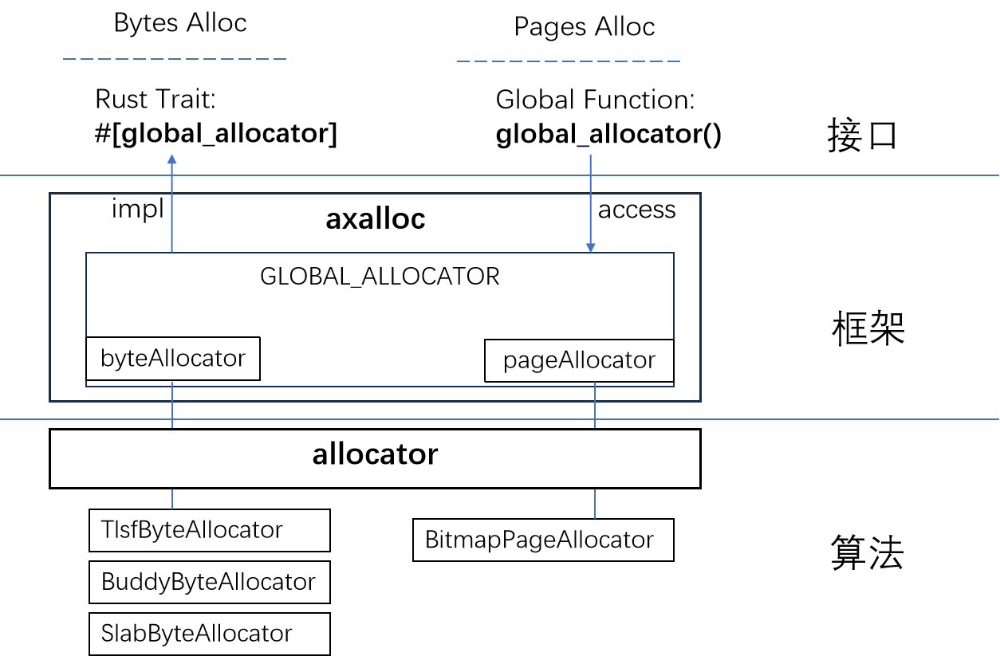

#### 接口和数据结构

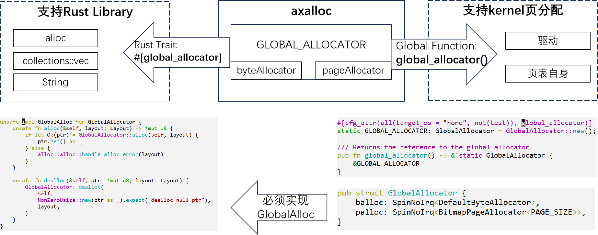

#### 框架初始化


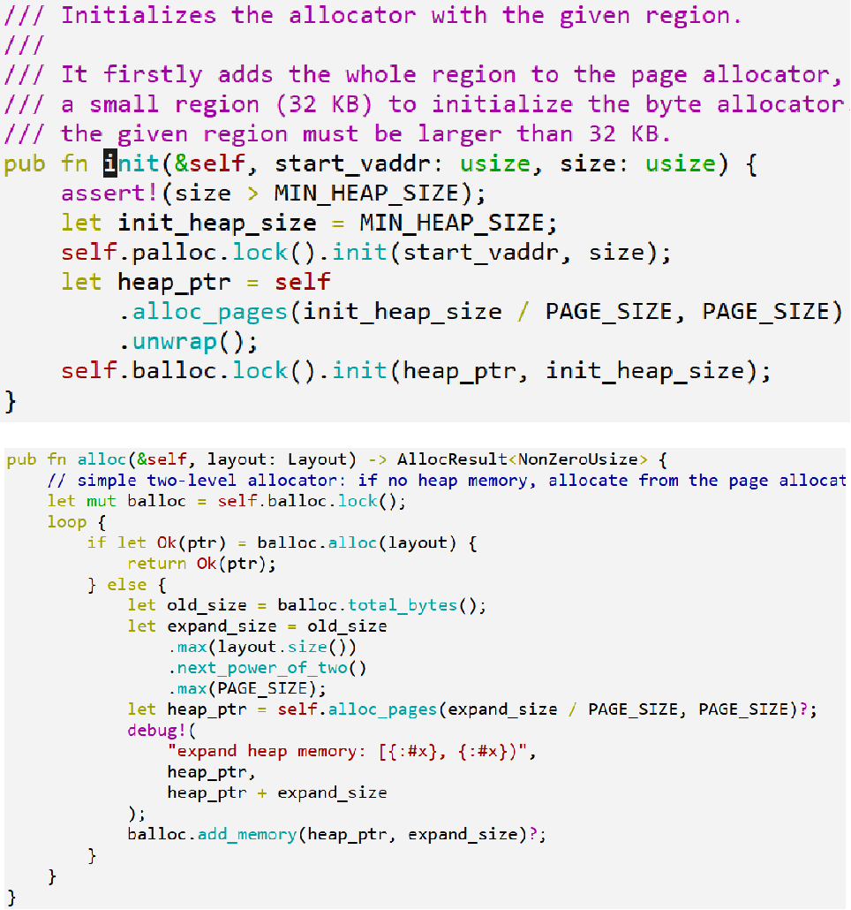

#### 算法组件接口

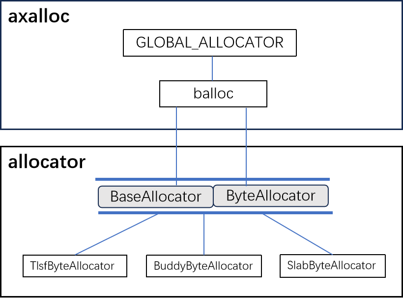


#### 内存分配算法

##### TLSF (Two-Level Segregated Fit)

两级 bitmap+List 管理空闲块

bitmap 第一级 First Level：每一位对应一个范围的内存块，示例中分别对应24 ~ 231。1表示空闲。图中两个1。

bitmap 第二级 Second Leve：有几位就表示几等分。例如， 2^6^ 表示 64~127，然后进行 4 等分，就是 64~79, 80~95, 96~107, 108~127，每一位对应一个范围，同样1表示空闲。

然后就能找到包含对应范围大小的空闲块链表List。链表耗尽或者新建时，对应维护两级bitmap。

[算法论文链接](http://www.gii.upv.es/tlsf/files/ecrts04_tlsf.pdf)

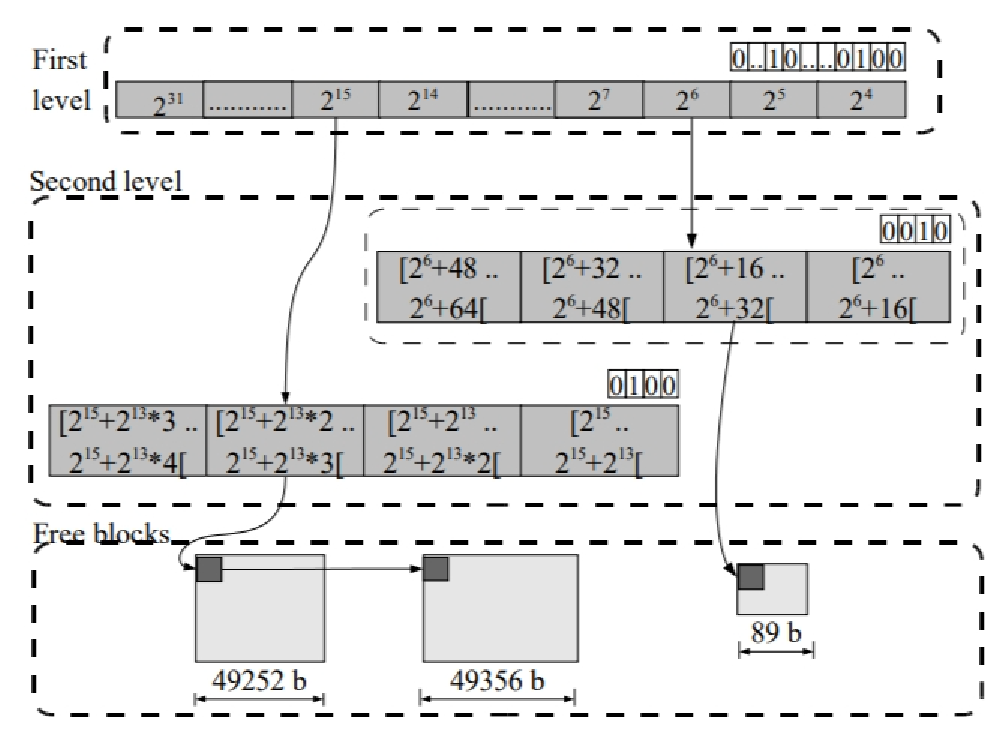

##### Buddy

分配单元 Unit：一般不会采用1字节，通常8，16，32…字节。

分配：寻找匹配 alloc 需要（order）的最小块如果 order 大于目标，则二分切割，直至相等，每级剩余的部分挂到对应的 Order List；

释放：查看是否有邻居空闲块，有则尽可能向高 Oder 合并，直至无法合并，挂到 OrderList。


##### Slab

结构：

1) 通过OrderList维护一系列Slab
1)  Slab维持一个空闲的block链表

分配：

从block空闲链表中弹出一个block。依靠BuddyAllocator提供内存分配支持，初始时以及block不足时，从BuddyAllocator申请，分割block后加入block空闲链表。

释放：

放回block空闲链表。

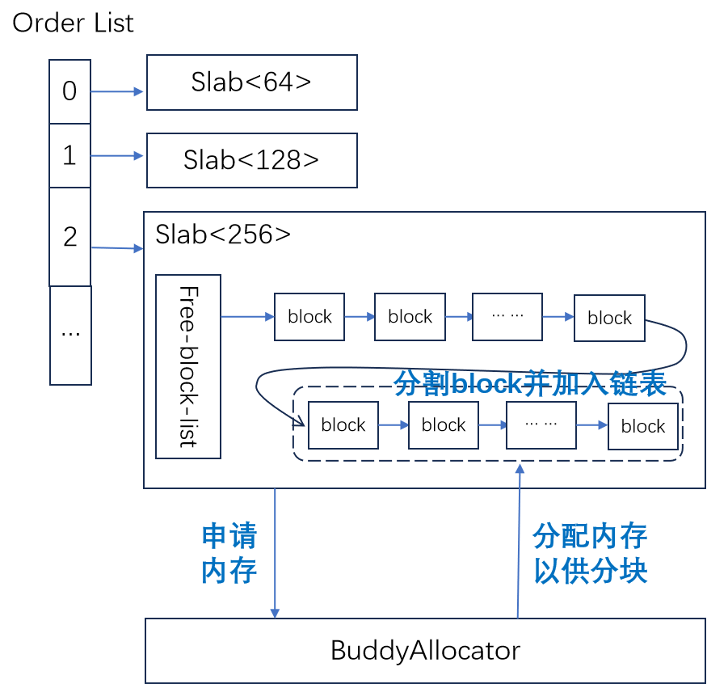

###  附录 相关组件


- #### ```allocator``` ：

  - 模块源码位置：[crates/allocator](https://github.com/rcore-os/arceos/tree/main/crates/allocator)
  - 模块描述： `allocator` 模块提供了一个统一的接口，用于实现不同类型的内存分配器算法。该模块共包括三种不同类型的分配器：字节粒度内存分配器 (`ByteAllocator`)、页粒度内存分配器 (`PageAllocator`) 和唯一 ID 分配器 (`IdAllocator`)。每种分配器都有其特定的实现方式，例如 `BuddyByteAllocator` 和 `SlabByteAllocator` 对应的是字节粒度内存分配器，而 `BitmapPageAllocator` 对应的是页粒度内存分配器。这个模块使得不同的内存分配器可以更加灵活地组合和替换，实现更加高效和可靠的内存管理功能。
