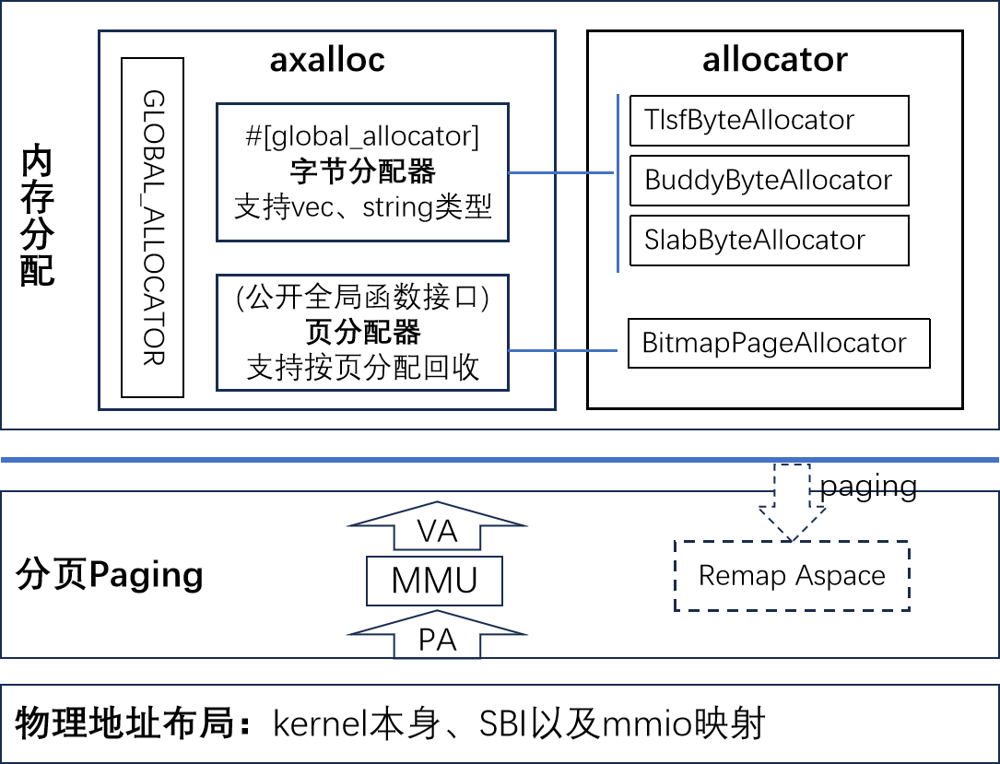

# 本章实践与总结

## 练习

待完善

## 实验

题目：针对字节内存分配，增加一个新的内存分配算法

要求：只能修改 crates/allocator/src/simple.rs，修改其中的数据结构和填充相关函数，执行 verify 脚本验证 a1 通过。

提示：

1. 可以参考现有的 tlsf，slab 等算法；或者其它了解的算法。
2. 提供一个 Bump 算法(最简版本)，供参考。
   - 关键数据成员: next 指针总是指向空闲区开始位置，计数 allocations 记录已经分配的次数；
   - 申请内存: 移动 next 位置指针， allocations 加一，返回移动前的 next；
   - 释放内存: allocations 减一。如果归零，复位 next 到起始位置；
   - 需要检查，分配和释放是否越界。

## 总结

v0.2 内存管理框架与功能：

1) 内存分配功能

   - 内含两类分配器，字节分配器和页分配器；
   - 框架与算法分离，松耦合支持多种内存分配算法。

2)  分页功能

   启动早期基于静态恒等映射完成分页切换，如果指定 paging feature 则会在启动后期重新建立范围更大，权限控制更细的映射。

