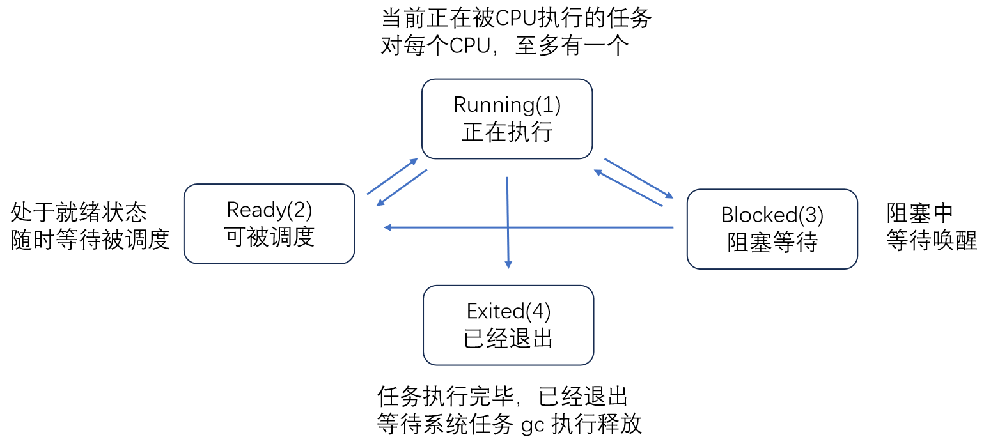
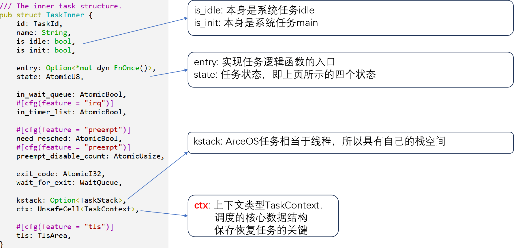
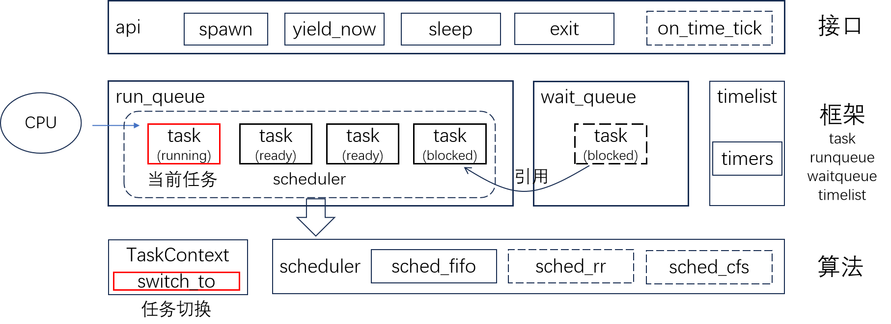
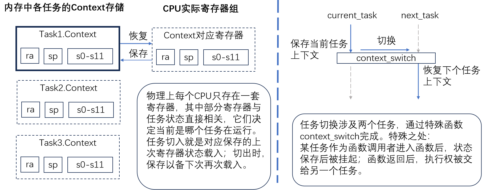
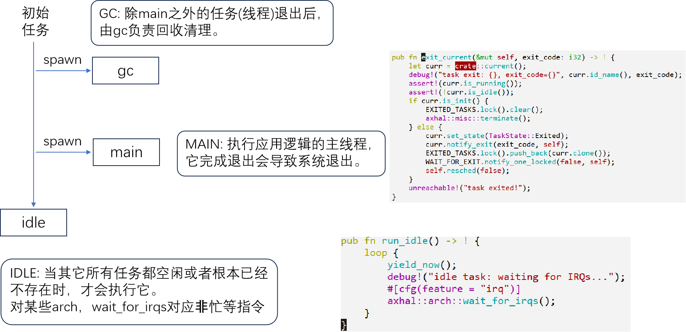

## 5.1 建立通用调度框架

### 5.1.1 任务

#### 一、任务状态

#### 二、任务数据结构

### 5.1.2 通用调度框架和初始化

#### 一、通用调度框架

框架支持协作式和抢占式调度。其中，标红的两处：

- 当前任务是操作的焦点；
- TaskContext.switch_to 是任务切换的关键。

#### 二、接口 - 主要调度API

接口公开的是 runqueue 的对应方法：

- spawn&spawn_raw：产生一个新任务，加入 runqueue，处于 Ready；
-  yield_now (协作式调度的关键)：主动让出 CPU 执行权；
-  sleep&sleep_until：(1)睡眠固定的时间后醒来；(2)在 timers 定时器列表中注册，等待唤醒；
-  exit：当前任务退出，标记状态，等待 GC 回收。

#### 三、调度框架初始化

#### 四、核心算法：context_switch

任务上下文 Context：保存任务状态的最小的寄存器状态集合。

下图是理解上下文切换的两个角度：

#### 五、上下文 Context 包含寄存器:

- ra:：函数返回地址寄存器，这个切换实现了任务执行指令流的切换；
- sp：任务即线程，这个是线程栈；
- s0~s11：按照 riscv 规范，callee 不能改这组寄存器的信息，所以需要保存。

### 5.1.3 系统内置任务idle, main和gc

