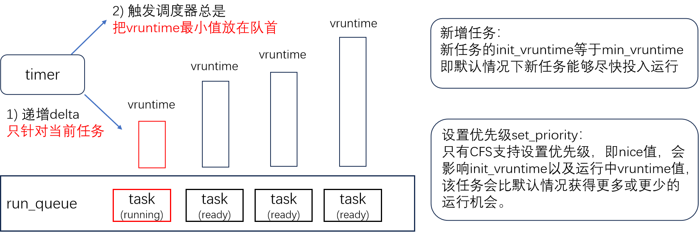
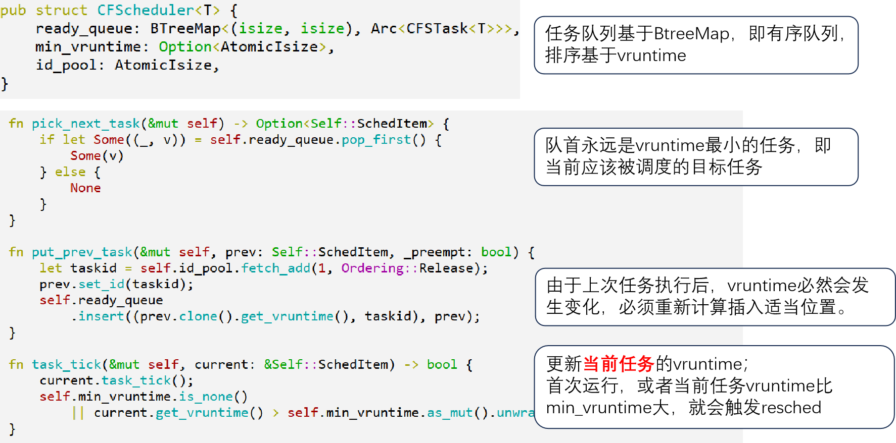
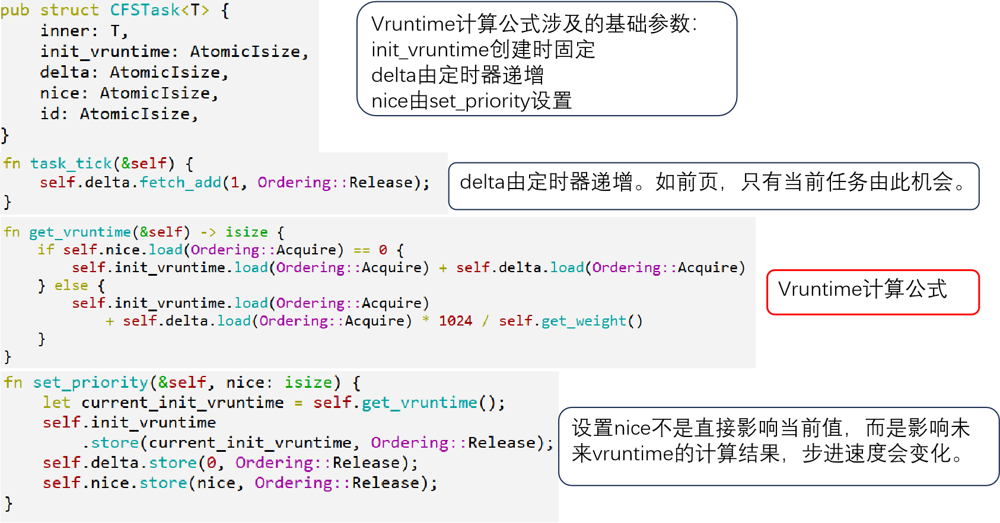

## 5.3 抢占式调度机制与示例

### 5.3.1 抢占式调度与协作式在框架上的区别

抢占式调度在协作式自主 yield 的基础上，通过加入时钟中断，确保个别任务不会长期不合理的占据 CPU。

### 5.3.2 时钟中断与抢占式调度

### 5.3.3 抢占式调度算法 ROUND_ROBIN

在协作式调度 FIFO 的基础上，由定时器定时递减当前任务的时间片，耗尽时排到队尾，如此完成各个任务的循环排列。

> **注👉** 
> 注意，各个scheduler操作的核心目标都是当前任务。

### 5.3.4 抢占式调度算法 CFS(Completely Fair Scheduler)

当前 vruntime 最小的任务就是当前任务。计算公式：
$$
vruntime = init_vruntime + (delta / weight(nice))
$$
系统初始化时，init_vruntime, delta, nice 三者都是 0

