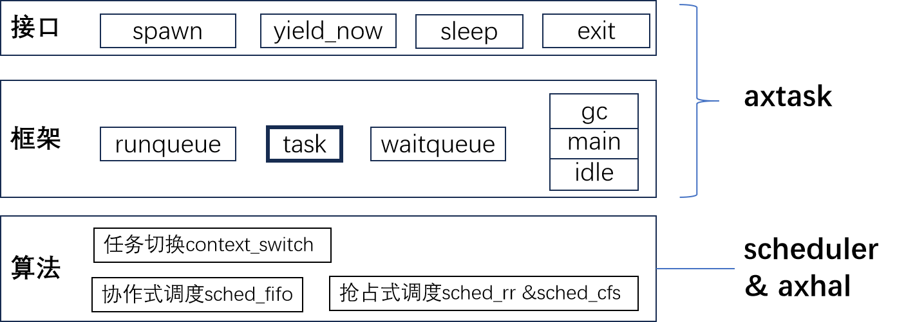

# 5.4 本章实践与总结

### 5.4.1 练习

待完善

### 5.4.2 实验

#### 实验1

题目：把协作式调度算法改造为抢占式调度算法。

要求：只能修改crates/scheduler/src/simple.rs，修改其中的数据结构和填充相关函数，执行verify脚本验证a2通过。

提示：

- 可以参考现有的sched_rr或sched_cfs等算法；或者其它了解的算法。
- 重点是发挥task_tick方法的作用。

#### 实验2

题目：支持ramfs的rename操作。

要求：只能修改crates/axfs_ramfs/src/dir.rs，增加相关函数，实现部分trait，执行verify脚本验证a3通过。

提示：无

### 5.4.3 总结

通过本章学习，建立了基础的调度框架，引入三个系统任务辅助任务管理。目前可以基于最简单的协作式和抢占式调度算法，支持多任务。

> **注👉**
>
> 注意，ArceOS 的抢占式调度与 Linux 所说的”抢占”有概念上的区别。

