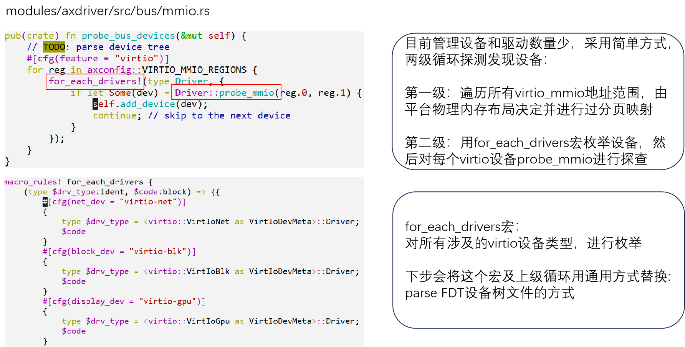
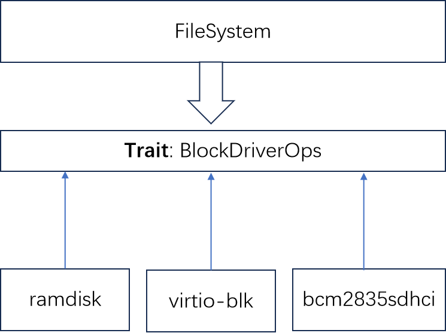

# 设计与实现

## 设备管理框架

AllDevices 管理系统所有的设备，为上层的子系统如文件系统 FS、网络协议栈 NET 提供访问服务。

三种设备类型：


## 设备发现与初始化过程


### 基于总线发现设备- qemu 平台示例



### virtio 设备的 probe 过程

1) qemu 模拟器基于命令行产生设备：

   ```
   -device virtio-blk-device,drive=disk0
   -drive id=disk0,format=raw,file=disk.img
   ```

2) qemu 将设备 mmio 地址区域映射到 Guest 中；

   qemu-virt 平台默认有 8 个区域槽位，通常只有部分会形成映射，其它处于未映射状态，即表现为空设备；

3) virtio-mmio 驱动逐个发请求区探查这些区域槽位；

   - 对应映射设备响应请求，返回本设备的类型 ID；
   - 没有映射的槽位返回零，表示空设备。

4) virtio-mmio 驱动把 probe 结果报告上层。


### virtio 驱动基本模型

virtio 驱动和 virtio 设备交互的两条路：

1. 主要基于 vring 环形队列：本质上是连续的 Page 页面，在 Guest 和 Host 都可见可写；
2. 中断响应的通道：主要对等待读取大块数据时是有用。


## 中断机制与初始化（以 riscv64 为例）


## 块设备驱动 - BlockDriver



### 块设备驱动 Trait - BlockDriverOps


