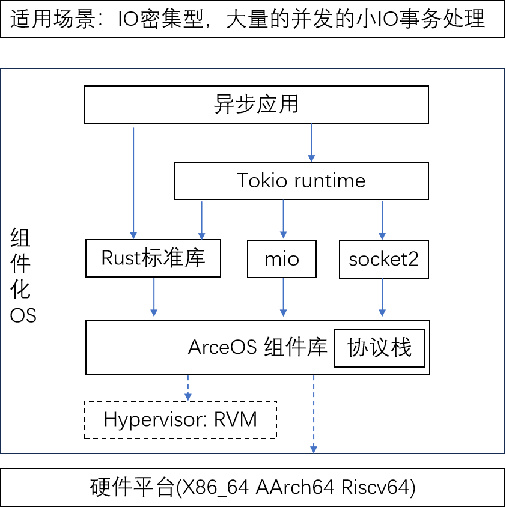
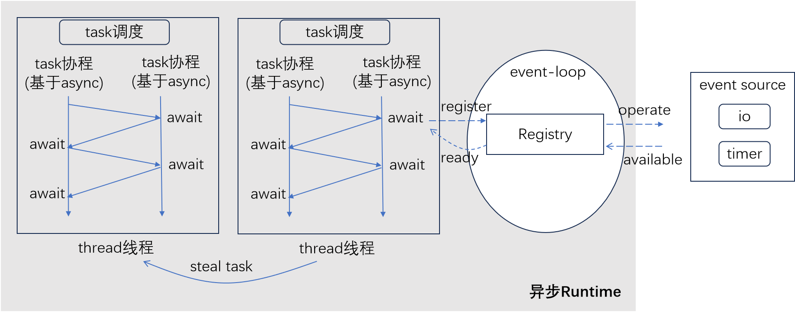

# 未来发展

## 异步

### **研究的基础**

1. IO 密集型是 AIoT 的典型场景，最适合采用异步
2. ArceOS 是应用为中心的 UniKernel OS，相对 Linux 等通用宏内核或微内核，其专用性更适应AIoT 特点
3. Rust语言级支持异步，即 async/await

### 研究的意义

面向 AIoT 的 IO 密集型场景，以组件化方式构建以应用为中心的 UniKernel OS，并发挥 Rust 对异步的内置支持能力。这种方案有可能比基于传统 OS 建立的方案，具有更高的运行效率和更小的Image。

### 需要解决的问题

1. Tokio 本身的改造，提升协程与线程的协作效率；
2. Rust 标准库支持 ArceOS 后端，编译时支持 ArceOS 这个 Target；
3. 改造 mio&socket2，支持 ArceOS 后端；
4. 改造网络协议栈这个组件，提升并发性；
5. 实现硬件平台驱动，重点支持 10G 网卡和中断。

异步环境下，存在两类调度实体：

1. 协程(tokio 中称 task)，基于 Rust 语言的异步特性 async/await，有专门的 task 调度。
2. 线程，即 OS 的线程。负责执行若干个 task 协程。并且具有特定条件下，steal task 的能力。

### 研究目标

在 ArceOS 平台上，协程与线程的高效协同。涉及调度策略、协程锁与线程锁，消息交换和共享等优化。

## 平台移植

树莓派 arm 平台的移植参考。arm 体系结构已存在，基本不用改；platform 增加对应目录，大部分代码可复用 aarch64_common 中内容。

## 宏内核/微内核

1) 从单地址空间到多地址空间；
2) 从单内核态到内核态+用户态；
3) 引入系统调用层以及进程相关的功能。

## 研究全景图

